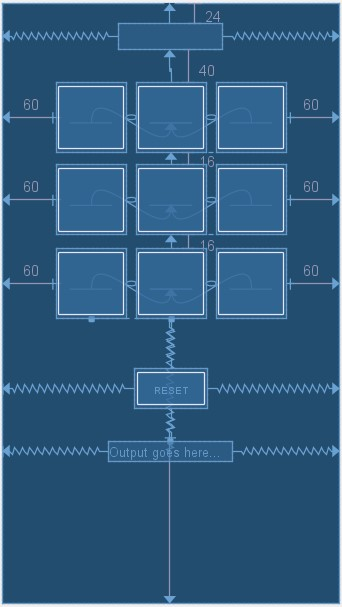
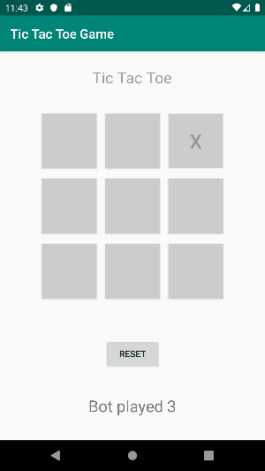
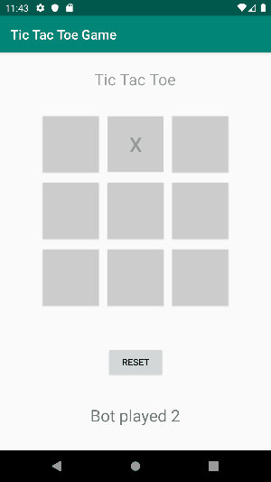
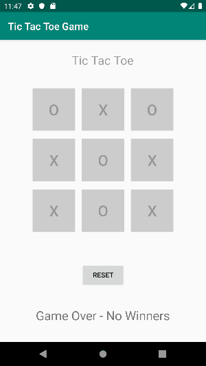

#### Tic Tac Toe Android App - User Vs Bot with AI


#### Design of the Game :

Thankfully, Android Studio is equipped with a layout designer, with drag and drop capabilities, you can easily and quickly drag and drop objects from a predefined list to the design layout board. The tricky part is how to be able to manipulate these objects during run time, how to access these resources and how to modify their values once the app runs on the emulator or any real world device. Here's a quick screenshot of what the design looks like:



#### Strings are tricky ?? Not really...

Its important during the design process to pay attention to any `String` values being hardcoded, as Android Studio will point that out with notifications and warnings, its always a good habit to have `String` values listed in the `strings.xml` file to keep all the values being assigned during run time. For example, we have a `TextView` object that is meant to store the title **Tic Tac Toe** on the main page of the App, defined in `activity_main.xml` as follows:
```XML
    <TextView
        android:id="@+id/title"
        android:layout_width="wrap_content"
        android:layout_height="wrap_content"
        android:layout_marginTop="24dp"
        android:hint="@string/title"
        android:textSize="24sp"
        app:layout_constraintEnd_toEndOf="parent"
        app:layout_constraintHorizontal_bias="0.498"
        app:layout_constraintStart_toStartOf="parent"
        app:layout_constraintTop_toTopOf="parent" />
```

Note that there is nothing in this `XML` code that defines the value of the `TextView` object. There is however, the line:

```XML
android:hint="@string/title"
```

which basically calls to fetch the value of the `String` _title_ from the `strings.xml` :
```XML
<resources>
    <string name="title">Tic Tac Toe</string>
</resources>
```
Note: Its also very easy now to maintain the app, if we need to change the `title`, all we need to do is change the value in `strings.xml` and the values change respectively anywhere we have used the **id** `title`.

#### AI aspect of the game:

Random numbers are generated using `Class Math` provided with Java SE libraries:

```JAVA
random = (int) (9 * Math.random()+1);
```

This AI is similar to the one we used in the Windows version of the [Tic Tac Toe](https://github.com/jayyusi/TicTacToe) with some changes to accommodate for Android. 


#### Player wins:




#### Bot wins:




#### Game Over - No Winners




#### Whats next ?

How can this game be improved ? We can add an algorithm for the Bot's moves, so that the Bot can block the user from winning, this would involve scanning the board, knowing which tiles are already taken and by who, and what it takes to make a win.